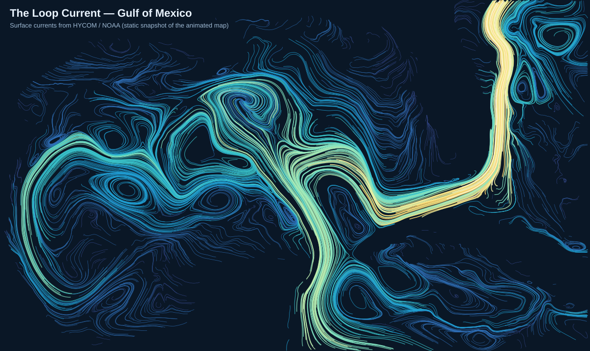

# Loop Current — Gulf of Mexico flow animation

An embeddable, animated map that shows how water moves through the Gulf of
Mexico: surging up through the **Yucatán Channel**, looping clockwise into the
eastern Gulf as the **Loop Current**, pinching off **anticyclonic eddies** that
drift west, and bending back through the **Straits of Florida** to feed the
**Gulf Stream**.

It reproduces the look of the
[GCOOS HYCOM ocean-current map](https://geo.gcoos.org/data/maps/gcoos-region/):
luminous "Firefly" satellite imagery with flowing particle streaklines colored
by current speed.



> **Data:** the animation is driven by **real HYCOM surface currents** for the
> Gulf, fetched from NOAA ERDDAP in CI and refreshed daily (see "How the data
> works"). If the data feed is ever unavailable, the page automatically falls
> back to a hand-composed *illustrative* field so the animation always plays.
> The on-map credit line shows which one is currently displayed and the data
> date.

## What's in here

| Path | Purpose |
| --- | --- |
| `index.html` | The standalone, embeddable page |
| `js/app.js` | Sets up the Leaflet map, basemap, and animated current layer |
| `tools/fetch-currents.js` | Pulls real HYCOM currents from NOAA ERDDAP → `data/gulf-currents.json` |
| `js/current-field.js` | Generates the fallback (illustrative) velocity field |
| `css/style.css` | Title, legend, and embed styling |
| `vendor/` | Vendored Leaflet + leaflet-velocity (no CDN needed at runtime) |
| `tools/render-preview.js` | Renders `poster.png`, a static streamline snapshot |
| `.github/workflows/pages.yml` | Fetches data, renders the poster, deploys to Pages |

The libraries are vendored locally, so at runtime the page only fetches the
current-data JSON (same-origin) and the satellite basemap tiles (from Esri). If
the tiles are ever unreachable, the page falls back to a dark ocean background
and the animation still plays.

## How the data works

The Loop Current is always shifting, so the map shows a recent real snapshot
rather than a hand-drawn cartoon:

1. `tools/fetch-currents.js` runs in GitHub Actions (which has open internet),
   searches NOAA/IOOS **ERDDAP** servers for HYCOM/RTOFS surface-current
   datasets, auto-detects the eastward/northward velocity variables and grid
   layout, subsets to the Gulf, and writes `data/gulf-currents.json` in the
   leaflet-velocity u/v grid format.
2. The Pages workflow bakes that JSON into the deployed site (so the browser
   loads it **same-origin** — no CORS headaches in a CMS embed) and refreshes it
   **daily** on a schedule.
3. `js/app.js` loads the JSON; if it's missing, it uses the procedural fallback.

You can run the fetch yourself anywhere with internet:

```bash
node tools/fetch-currents.js   # writes data/gulf-currents.json
```

## Run / preview locally

It's all static files — serve the folder with any web server:

```bash
python3 -m http.server 8000
# then open http://localhost:8000/
```

(Open it through a server rather than `file://` so the browser can load the
local scripts.)

## Embed it in a CMS

Host this folder somewhere (any static host: S3 + CloudFront, Netlify, GitHub
Pages, your own server) and drop an `<iframe>` into the article:

```html
<iframe
  src="https://YOUR-HOST/path/to/loop-current/index.html"
  width="100%"
  height="520"
  style="border:0; aspect-ratio: 16 / 9; max-width: 960px;"
  loading="lazy"
  title="The Loop Current — Gulf of Mexico"
  allowfullscreen></iframe>
```

Tips for newsroom embeds:
- The map **does not** grab the page's scroll wheel. A reader has to click the
  map first to zoom — so it won't hijack scrolling in a long article.
- It's fully responsive; it fills whatever box the iframe gives it.
- `poster.png` works as a social-card / `og:image` and as a lightweight preview.

## Tuning the flow

Everything visual lives in two places and is easy to adjust.

**Look & feel — `js/app.js`:**

| Option | Effect |
| --- | --- |
| `velocityScale` | How fast particles move |
| `particleMultiplier` | Streak density (smaller denominator = more streaks) |
| `particleAge` | How long a streak lives before it's reborn |
| `lineWidth` | Streak thickness |
| `maxVelocity` | Speed mapped to the brightest end of the color scale |
| `colorScale` | The blue→cyan→gold→white speed ramp |

**The data source — `tools/fetch-currents.js`:**

- `SERVERS` / `SEARCH_TERMS` — which ERDDAP servers and models to search.
- `BBOX` — the geographic box pulled from the dataset.
- `STRIDE` — grid downsampling (1 = native ~0.08° resolution).

**The fallback pattern — `js/current-field.js`** (only shown if the data feed
fails):

- `CENTERLINE` — the Loop Current / Gulf Stream path, as `[lon, lat, speed]`
  waypoints.
- `EDDIES` — the rotating rings (`spin: 1` = clockwise/anticyclonic, `-1` =
  cyclonic).
- `JET_WIDTH`, `BACKGROUND` — jet breadth and the gentle ambient drift.

Re-render the poster after changing anything:

```bash
node tools/render-preview.js > preview.svg   # uses real data if present
```

## Credits

- Current data: [HYCOM](https://www.hycom.org/) via
  [NOAA ERDDAP](https://www.ncei.noaa.gov/erddap/) (the same model family the
  GCOOS map uses)
- Basemap imagery © [Esri](https://www.esri.com/), Maxar, Earthstar Geographics
- Particle engine: [leaflet-velocity](https://github.com/onaci/leaflet-velocity)
  (a Leaflet port of the earth.nullschool / Windy wind-particle renderer)
- Mapping: [Leaflet](https://leafletjs.com/)
- Inspired by the [GCOOS](https://geo.gcoos.org/data/maps/gcoos-region/) Gulf
  region ocean-current map.
